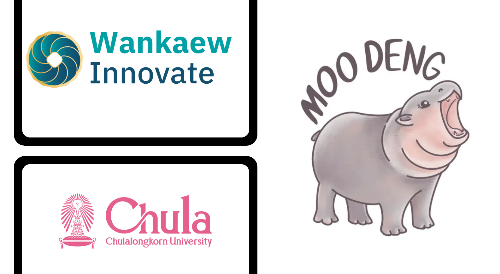
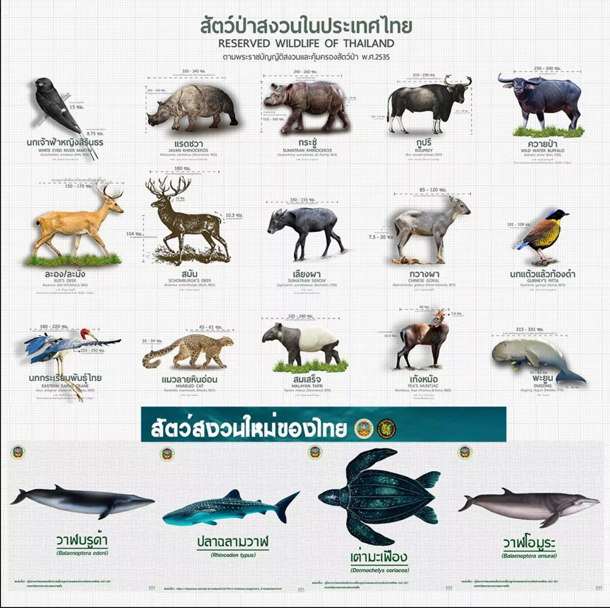
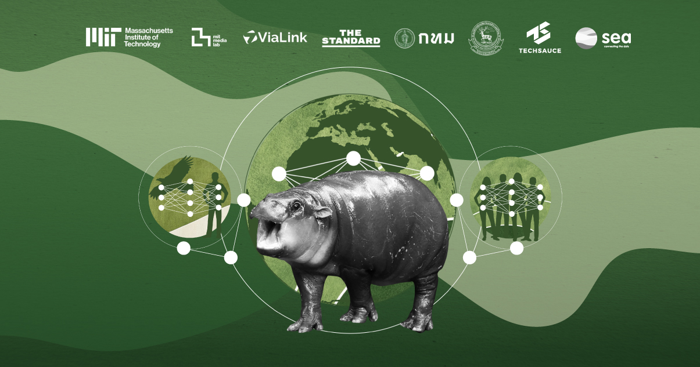

# **BeloveThaiAI**:  
- **Be**havior and 🐾  
- **Lo**cation with 🌍  
- **Ve**rification of ✅  
Thailand's Unique Wildlife AI 🦏🌿




## 🦄 AI for Detecting Behavior and Location of Thailand's Unique Wildlife 🐅

### 🌿 Promoting Conservation and Understanding of Animals in Their Homeland 🌍

Welcome to **BeloveThaiAI**! 🚀 This project is all about building an AI-powered model for **detecting and tracking the behavior and location** of Thailand's unique wildlife 🐒. Our mission? To use cutting-edge tech to monitor, analyze, and protect the incredible animals that call Thailand home. 🐅🌱



## 🌟 Our Vision 🌟

Thailand is rich in biodiversity, and we believe it's crucial to harness AI to help protect and understand its endemic species 🦏. With **BeloveThaiAI**, we aim to track animal behavior and location in real-time using **AI**, providing essential data to help **conserve** and **celebrate** Thailand’s unique wildlife! 🌿

### **BeloveThaiAI**:  
- **Be**havior and 🐾  
- **Lo**cation with 🌍  
- **Ve**rification of ✅  
- Thailand's Unique Wildlife AI 🦏🌿



### 🛠️ Key Features of the AI Model 🛠️
- **Behavior Detection:** 🎥 Using ML algorithms to analyze footage and detect animal behaviors like feeding, mating, migration, and more. 👀  
- **Location Tracking:** 📍 Integrating geospatial data to track animal movement across Thailand’s diverse landscapes. 🌳  
- **Endemic Species Focus:** 🦇 The model will focus on Thailand’s 8 endemic mammals, 2 endemic birds, and many reptiles and amphibians! 🦎

### 🦧 AI Model Use Cases 🚀
1. **Wildlife Conservation:** 🌍 Our AI model will help track endangered species, identify critical habitats, and detect threats to their survival. 🐾  
2. **Human-Animal Interaction:** 🤝 Understand how animals interact with their environment, helping humans and wildlife coexist. 🌿  
3. **Research & Education:** 📚 Providing valuable data to researchers, conservationists, and educators to protect Thailand’s biodiversity! 🧠

## 🦸‍♂️ Thailand’s Unique Wildlife: Key Species 🦸‍♀️

Thailand is home to several **endemic species** found nowhere else on the planet 🌏. Our AI model will help track and protect these species, including:

### **Endemic Mammals** 🐾
- **Kitti’s Hog-nosed Bat** (Craseonycteris thonglongyai) 🦇
- **Marshall's Leaf-nosed Bat** (Rhinolophus marshalli) 🦇
- **Giant Leaf-nosed Bat** (Hipposideros halophyllus) 🦇
- **Saratthani Brown Water Bat** (Eptesicus demissus) 🦇
- **Limestone Rat** (Niviventer hinpoon) 🐀
- **Bangkachak Rat** (Bandicota bangchakensis) 🐀
- **Cave Rat** (Leopoldamys neilli) 🐀
- **Schomburgk’s Deer** (Cervus schomburgki) 🦌

### **Endemic Birds** 🦜
- **Sirindhorn’s White-eyed River-Martin** (Pseudochelidon sirintarae) 🐦  
- **Deignan's Babbler** (Stachyris rodolphei) 🐦

### **Endemic Reptiles & Amphibians** 🦎
- **31 Reptiles** 🐍  
- **13 Amphibians** 🐸

## 🤖 AI Technology Stack 💻

**BeloveThaiAI** will use an all-star team of technologies to get the job done! 🚀

- **Computer Vision:** 🖼️ Analyzing images and video to detect animal behaviors with precision. 🎯  
- **Geospatial Analytics:** 📍 Tracking animal movements using GPS and satellite data to understand migration and habitat. 🌍  
- **Deep Learning:** 🤖 Using neural networks to classify species and track animal behavior in real-time.  
- **IoT Integration:** 🌐 Collecting data from wildlife cameras, acoustic sensors, and GPS trackers to feed our AI model.

## 💥 Why This Project Matters 🌍

Thailand's unique wildlife is under threat from **habitat destruction**, **poaching**, and **climate change** 🌡️. By using **AI** to track and understand these animals, **BeloveThaiAI** will play a crucial role in their **conservation** and **protection**. 🦏

Our model also fosters a deeper **connection** between humans and animals, inspiring greater efforts toward **biodiversity conservation** and promoting a more sustainable coexistence. 🌱💪

## 🌐 Learn More About the Moodeng AI Challenge 🎉

For more details about the **Moodeng AI Challenge**, check out the official [Moodeng Media Website](https://moodeng.media.mit.edu/)!

---

## 🧠 Our AI Model Idea

We're building a **Transformer-based neural architecture** that can:

- 🔍 **Detect and classify** endemic Thai species from image/video input  
- 🧭 **Tag locations** and patterns to monitor habitat and migration  
- 🎥 **Understand behaviors** (feeding, moving, interactions)  
- 🛠️ Be deployed for **education**, **conservation**, and **eco-tourism**

Built with:
- PyTorch + HuggingFace/timm  
- Vision Transformer (ViT) / Swin / DeiT / BEiT  
- Optional multi-modal (image + GPS data) extensions  
- Expandable to real-time inference on mobile or camera traps

---

## 💡 How It Works (Simplified)
```text
📷 Image Input → ViT Backbone → Feature Encoding →
🧠 Behavior & Species Head → 🧭 Location Mapping →
📊 Output: Class, Confidence, Location, Behavior
```

---

## 🚀 Who We Are
We're **Team BeloveThaiAI** 💚  
A passionate mix of AI researchers, conservationists, and developers who believe **wildlife deserves a voice powered by AI.**

---

## 📚 References

- 🦁 Thai Wildlife Info: [thezootravel.com](https://thezootravel.com)  
- 📊 Dataset sources: [Kaggle Datasets](https://www.kaggle.com/datasets)  
- 🔥 Framework: [PyTorch](https://pytorch.org/)  
- 🐶 Moodeng Logo: [Moodeng Logo](https://www.reddit.com/r/moodeng/comments/1gmy9x3/the_zoo_has_announced_the_official_moodeng_logo/?tl=th)

---

> 🙌 Let’s build a future where **AI helps humans reconnect with nature**.  
> #BeloveThaiAI 🌱🐾

---